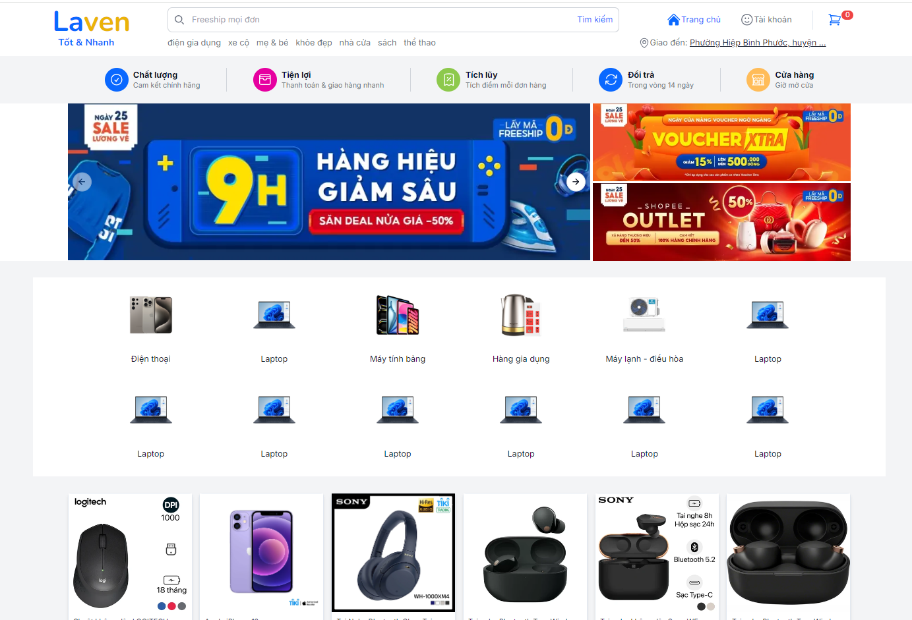
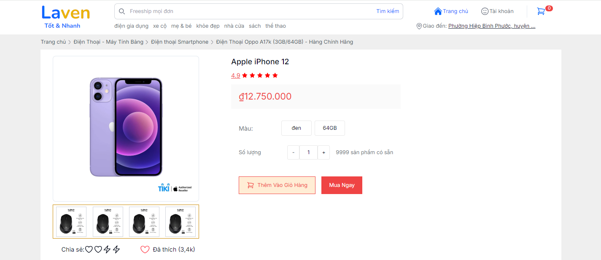
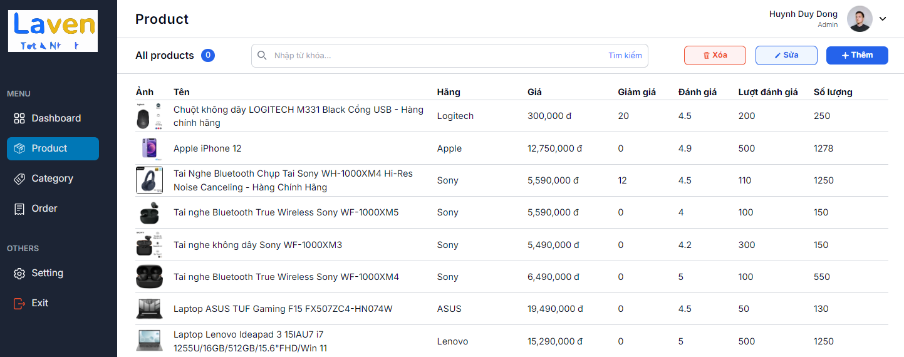

# LavenShop
Link to Frontend repo: [Laven FE](https://github.com/huynhduydong/LavenFontend)
## Introduction
### Project: Laven - E-commerce Platform
- Back-end:Built with Spring Boot, providing a scalable and secure foundation for handling API requests, business logic, and database management.
- Front-end:Developed using Next.js for server-side rendering and React.js for building dynamic, interactive user interfaces.
- Styling:TailwindCSS is utilized to create a modern, responsive design with a focus on efficiency and ease of customization.
- Key Features: Includes product browsing, cart management, and secure checkout processes, delivering an optimized and user-friendly shopping experience.
- Objective: To create a high-performance e-commerce platform that is scalable, maintainable, and provides a seamless experience for both users and administrators.

## Features
### Technologies and Framework
- Back-end
  - Java 17
  - Spring Boot 3: Authorization Server(OAuth2)
  - Zipkin
  - Redis
- Front-end
  - NextJS 14
  - ReactJS
  - TailwindCSS
  - RadixUI
  - ShadcnUI 
### Demo
Some of the pictures of this Application
- Front-end:
<div align="center">
  
  <p><i>Homepage Screen</i></p>
</div>

<div align="center">
  
  <p><i>Detail product Screen</i></p>
</div>

<div align="center">
  
  <p><i>Admin product Screen</i></p>
</div>

## Setup

1. Clone the repository:
   ```
   git clone https://github.com/huynhduydong/MasterShop
   ```
2. Navigate to the project directory:
   ```
   cd LavenShop
   ```
3. Install dependencies::
   ```
   npm install
   ```
4. Run the development server:
   ```
   npm run dev


  